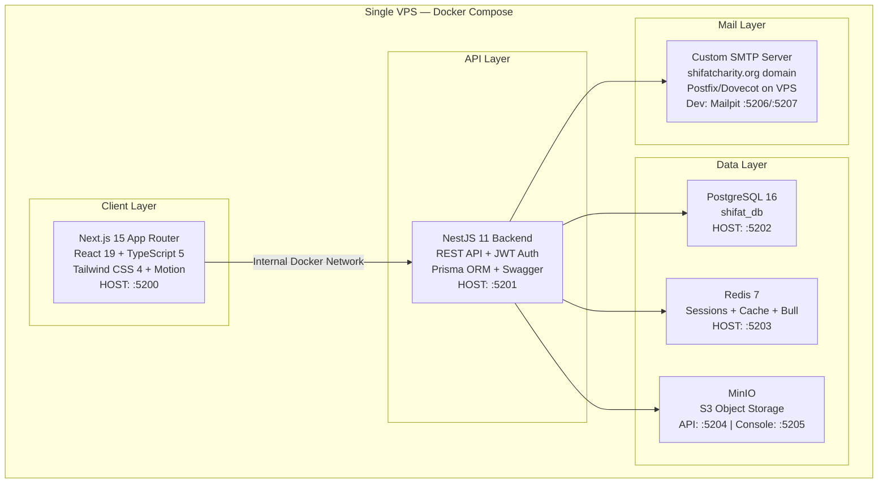
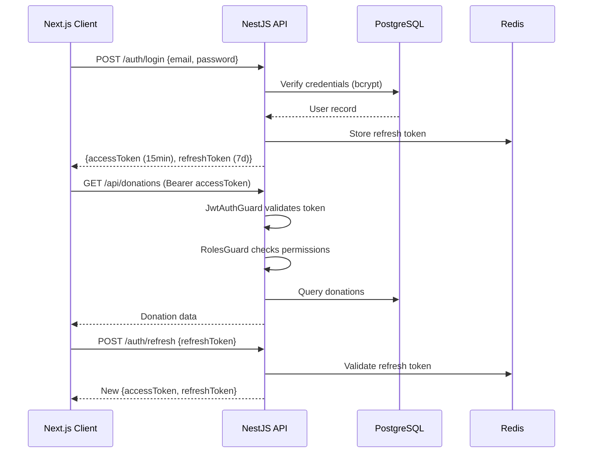

# SHiFAT Charity Platform — Comprehensive Audit & Dashboard Implementation Plan

> [!IMPORTANT]
> **Status: APPROVED — Ready for Execution.** All open questions answered. Decisions finalized and reflected below.

---

## Part 1: Project Audit Report

### 1.1 Executive Summary

SHiFAT (Somali Health Initiative For All Trust) is currently a **client-side-only Single Page Application** built with React 18 + Vite + Tailwind CSS 4. It serves as a public-facing knowledge portal, mobilization center, and donation gateway. The application has **zero backend infrastructure** — no server, no database, no authentication, no API layer. All data is hardcoded in a static TypeScript file ([data.ts](file:///c:/dev/shifat-charity/src/data.ts)), and all "processing" (donations, applications, newsletters) is simulated with `setTimeout` calls.

### 1.2 Current Architecture Inventory

#### File & Component Map

| File | Size | Purpose |
|------|------|---------|
| [App.tsx](file:///c:/dev/shifat-charity/src/App.tsx) | 10.8 KB | Root SPA router via `useState` switch-case |
| [Navbar.tsx](file:///c:/dev/shifat-charity/src/components/Navbar.tsx) | 25.5 KB | Desktop mega-menu + mobile accordion nav |
| [DonateForm.tsx](file:///c:/dev/shifat-charity/src/components/DonateForm.tsx) | 27.0 KB | Full donation gateway (simulated) |
| [VolunteerForm.tsx](file:///c:/dev/shifat-charity/src/components/VolunteerForm.tsx) | 17.4 KB | Career applications with drag-and-drop uploader |
| [Hero.tsx](file:///c:/dev/shifat-charity/src/components/Hero.tsx) | 7.7 KB | Auto-sliding hero carousel |
| [ContactSection.tsx](file:///c:/dev/shifat-charity/src/components/ContactSection.tsx) | 13.4 KB | Contact form + FAQ accordion |
| [PublicationsSection.tsx](file:///c:/dev/shifat-charity/src/components/PublicationsSection.tsx) | 14.2 KB | Document repository with search + simulated downloads |
| [ProjectsSection.tsx](file:///c:/dev/shifat-charity/src/components/ProjectsSection.tsx) | 13.3 KB | Filterable project grid |
| [AboutSection.tsx](file:///c:/dev/shifat-charity/src/components/AboutSection.tsx) | 14.6 KB | Mission/Vision + team bio modals |
| [ProgramsSection.tsx](file:///c:/dev/shifat-charity/src/components/ProgramsSection.tsx) | 11.9 KB | 6 health pillars with detail modals |
| [ImpactStats.tsx](file:///c:/dev/shifat-charity/src/components/ImpactStats.tsx) | 12.3 KB | Animated statistics + budget breakdown |
| [PartnersSection.tsx](file:///c:/dev/shifat-charity/src/components/PartnersSection.tsx) | 9.8 KB | Partner grid + inquiry form |
| [CampaignsSection.tsx](file:///c:/dev/shifat-charity/src/components/CampaignsSection.tsx) | 6.5 KB | Campaign cards with progress bars |
| [NewsSection.tsx](file:///c:/dev/shifat-charity/src/components/NewsSection.tsx) | 9.1 KB | News timeline with article reader |
| [Footer.tsx](file:///c:/dev/shifat-charity/src/components/Footer.tsx) | 8.4 KB | Footer with newsletter signup |
| [BrandLogo.tsx](file:///c:/dev/shifat-charity/src/components/BrandLogo.tsx) | 2.0 KB | Custom SVG brand emblem |
| [types.ts](file:///c:/dev/shifat-charity/src/types.ts) | 1.9 KB | 9 TypeScript interfaces |
| [data.ts](file:///c:/dev/shifat-charity/src/data.ts) | 25.9 KB | Static data dictionaries (all content) |
| [index.css](file:///c:/dev/shifat-charity/src/index.css) | 1.5 KB | Theme tokens + custom utilities |

**Total source**: ~232 KB across 18 files (15 components + 3 core files)

#### Tech Stack

| Layer | Current | Version |
|-------|---------|---------|
| Framework | React | 19.0.1 (listed as 18 in docs, but package.json says 19) |
| Bundler | Vite | 6.2.3 |
| Language | TypeScript | 5.8.2 |
| Styling | Tailwind CSS | 4.1.14 |
| Animation | Motion (Framer Motion) | 12.23.24 |
| Icons | Lucide React | 0.546.0 |
| AI SDK | @google/genai | 2.4.0 (installed but unused) |
| Server | Express | 4.21.2 (installed but unused — no server file exists) |
| Backend | **NONE** | — |
| Database | **NONE** | — |
| Auth | **NONE** | — |
| Object Storage | **NONE** | — |

#### Critical Findings

> [!CAUTION]
> **No Real Backend Exists.** Despite `express` being in dependencies and `.env.example` referencing `APP_URL`, there is no `server.ts`, no API routes, no Express app, no database connection — nothing. The app is 100% static.

> [!WARNING]
> **All Data is Hardcoded.** Every program, campaign, project, news item, team member, FAQ, partner, career opportunity, and publication is stored as a TypeScript constant in [data.ts](file:///c:/dev/shifat-charity/src/data.ts). There is no way to add, edit, or delete content without modifying source code.

> [!WARNING]
> **All Forms are Simulated.** Donation processing, volunteer applications, contact forms, and newsletter subscriptions perform no actual API calls. They use `setTimeout` to fake a 2.5-second "processing" delay and then display mock receipts/confirmations.

> [!WARNING]
> **No Client-Side Router.** Navigation is managed via `useState<string>('home')` in [App.tsx](file:///c:/dev/shifat-charity/src/App.tsx). There are no URL routes — refreshing the page always returns to `home`. Deep linking, browser back/forward, and SEO-friendly URLs are impossible.

> [!IMPORTANT]
> **React Version Mismatch.** The manifest says "React 18" but [package.json](file:///c:/dev/shifat-charity/package.json) declares `react: ^19.0.1`. This is actually React 19.

> [!NOTE]
> **Unused Dependencies.** Both `@google/genai` and `express` are installed but never imported or used anywhere in the codebase. These add bundle size and should be cleaned up.

---

## Part 2: Technology Stack Recommendation

### The Core Question: Next.js + NestJS vs. Current React SPA?

> **Verdict: YES — Migrate to Next.js (Frontend) + NestJS (Backend). This is the correct architecture for this project.**

Here is the full comparison and reasoning:

### 2.1 Architecture Comparison Matrix

| Concern | Current (React SPA + Vite) | Proposed (Next.js + NestJS) |
|---------|---------------------------|----------------------------|
| **Routing** | `useState` switch-case, no URLs | File-based routing with `app/` directory, full URL support |
| **SEO** | Zero — CSR only, no meta tags, no crawlability | SSR/SSG pages, full `<head>` management via `metadata` API |
| **Backend API** | None | NestJS with controllers, services, DTOs, guards, pipes |
| **Database** | None | PostgreSQL via TypeORM/Prisma |
| **Caching** | None | Redis for sessions, rate limiting, job queues |
| **File Uploads** | Simulated drag-and-drop (no actual upload) | MinIO S3-compatible object storage |
| **Authentication** | None | JWT with access + refresh tokens, RBAC |
| **Admin Dashboard** | None | Full CRUD admin panel with role-based access |
| **User Dashboard** | None | Donor profiles, donation history, tax receipts |
| **Donation Processing** | Fake `setTimeout` | Real payment integration (ZAAD, e-Dahab, Stripe) |
| **Email** | None | Transactional emails (receipts, confirmations) |
| **Image Optimization** | Raw `` tags with Unsplash URLs | `next/image` with automatic optimization |
| **Deployment** | Static hosting only | Vercel/Docker/VPS with full-stack support |
| **Content Management** | Edit TypeScript source code | Admin dashboard with live CRUD |

### 2.2 Why NOT Stay with React 18 (Vite SPA)?

> [!CAUTION]
> Staying with the current architecture is a **dead end** for the features you need:

1. **No backend = No admin dashboard.** You cannot build user management, content management, or donation tracking without a server.
2. **No SEO.** A charity website that cannot be found on Google is a failed charity website. SPA-only React apps are nearly invisible to search crawlers.
3. **No real data persistence.** Every content change requires a developer to edit TypeScript files and redeploy.
4. **No security.** Payment data, user credentials, and donor information cannot be handled securely in a client-only application.
5. **The existing frontend is reusable.** All 15 React components, all TypeScript types, and all styling can be directly migrated to Next.js with minimal changes (Tailwind, Lucide, and Motion all work identically in Next.js).

### 2.3 Why Next.js Specifically (not plain React)?

| Capability | React SPA | Next.js |
|-----------|-----------|---------|
| Server-Side Rendering | ❌ | ✅ |
| Static Site Generation | ❌ | ✅ |
| API Routes (optional lightweight endpoints) | ❌ | ✅ |
| File-based Routing | ❌ | ✅ |
| Image Optimization | ❌ | ✅ |
| SEO Metadata API | ❌ | ✅ |
| Middleware (redirects, auth checks) | ❌ | ✅ |
| Incremental Static Regeneration | ❌ | ✅ |

### 2.4 Why NestJS for Backend (not Express raw)?

| Capability | Raw Express | NestJS |
|-----------|-------------|--------|
| Modular Architecture | Manual | Built-in (Modules, Controllers, Services) |
| Dependency Injection | Manual | Built-in |
| DTO Validation | Manual | `class-validator` + `class-transformer` pipes |
| Auth Guards | Manual middleware | `@UseGuards()` decorator with JWT/RBAC |
| TypeORM/Prisma Integration | Manual setup | First-class module support |
| Swagger/OpenAPI Docs | Manual | `@nestjs/swagger` auto-generates from decorators |
| WebSocket Support | Manual | `@nestjs/websockets` gateway |
| Queue/Job Processing | Manual | `@nestjs/bull` with Redis |
| Testing | Manual | Built-in testing utilities with Jest |

### 2.5 Finalized Technology Decisions

| Decision | Choice | Reasoning |
|----------|--------|-----------|
| **Frontend** | Next.js 15 (App Router) | SSR, SEO, file-based routing |
| **Backend** | NestJS 11 | Modular, DI, RBAC guards, TypeScript-native |
| **Monorepo** | **Turborepo** | Build caching, parallel task execution, workspace orchestration |
| **ORM** | **Prisma** | Type-safe schema, auto-generated client, excellent migration tooling |
| **Deployment** | **Single VPS** (Docker Compose) | All services co-located, cost-effective |
| **Email** | **Custom SMTP** on VPS using `shifatcharity.org` domain | Full control, no third-party dependency, Nodemailer in NestJS |
| **Payments** | ZAAD + e-Dahab + Premier Wallet + Premier Bank MasterCard API + Stripe | All mocked during development; real credentials added per client |
| **Brand Colors** | **Blue (Dominant)** / **Green (Secondary)** | Swap colors to make Blue the primary visual brand identity |

### 2.6 Port Conflict Analysis & Resolution

#### Currently Occupied Ports (Docker + System)

| Port | Occupied By | Status |
|------|-------------|--------|
| `3000` | kibabii-nest-web + system process PID 22160 | 🔴 **CONFLICT** |
| `5432` | kibabii-db (PostgreSQL, **UP**) | 🔴 **CONFLICT** |
| `6379` | — (standard Redis port free) | ✅ Free |
| `6380` | kibabii-nest-redis-1 (Redis, **UP**) | 🔴 **CONFLICT** |
| `9000` | kibabii-backend + kibabii-minio (**UP**) | 🔴 **CONFLICT** |
| `9001` | kibabii-minio (**UP**) | 🔴 **CONFLICT** |
| `9002` | kibabii-minio (**UP**) | 🔴 **CONFLICT** |
| `3306` | MySQL (system) | 🔴 Avoid |
| `80` / `443` | System (IIS/proxy) | 🔴 Avoid |

> [!IMPORTANT]
> **SHiFAT uses an entirely conflict-free port range (5200–5209).** No existing container, system service, or process on this machine occupies any port in this range.

#### ✅ SHiFAT Assigned Port Map

| Service | Container Port | Host Port | Notes |
|---------|---------------|-----------|-------|
| **Next.js (web)** | 3000 | **5200** | Dev server + production SSR |
| **NestJS (api)** | 4000 | **5201** | REST API backend |
| **PostgreSQL** | 5432 | **5202** | shifat_db database |
| **Redis** | 6379 | **5203** | Sessions, cache, Bull queues |
| **MinIO API** | 9000 | **5204** | S3-compatible object storage |
| **MinIO Console** | 9001 | **5205** | MinIO admin UI |
| **Mailpit (SMTP)** | 1025 | **5206** | Local dev email SMTP catcher |
| **Mailpit (Web UI)** | 8025 | **5207** | Local dev email inbox preview |

### 2.7 Infrastructure Architecture (Finalized)



### 2.8 Payment Integration Plan

| Provider | Type | Integration Phase | Notes |
|----------|------|-------------------|-------|
| **ZAAD (Telesom)** | Mobile Money | Mock → Real | Push prompt to mobile handset |
| **e-Dahab (Somtel)** | Mobile Money | Mock → Real | Push prompt to Somtel SIM |
| **Premier Wallet** | Mobile Wallet | Mock → Real | Premier Bank digital wallet |
| **Premier Bank MasterCard** | Card Gateway | Mock → Real | Premier Bank API credentials |
| **Stripe** | International Card | Mock → Real | Stripe SDK, webhooks for confirmations |

All 5 providers share a unified `PaymentService` abstraction in NestJS. Switching from mock to real is done by setting `PAYMENT_MODE=live` in the environment and providing API keys — no code changes required.

---

## Part 3: Admin & User Dashboard Implementation Plan

### 3.1 Project Structure (Monorepo)

```
shifat-charity/
├── apps/
│   ├── web/                          # Next.js 15 Frontend
│   │   ├── app/
│   │   │   ├── (public)/             # Public-facing pages
│   │   │   │   ├── page.tsx          # Home (migrated from Hero + ImpactStats)
│   │   │   │   ├── about/page.tsx
│   │   │   │   ├── programs/page.tsx
│   │   │   │   ├── campaigns/page.tsx
│   │   │   │   ├── projects/page.tsx
│   │   │   │   ├── news/page.tsx
│   │   │   │   ├── publications/page.tsx
│   │   │   │   ├── get-involved/page.tsx
│   │   │   │   ├── partners/page.tsx
│   │   │   │   ├── contact/page.tsx
│   │   │   │   └── donate/page.tsx
│   │   │   ├── (auth)/               # Authentication pages
│   │   │   │   ├── login/page.tsx
│   │   │   │   ├── register/page.tsx
│   │   │   │   └── forgot-password/page.tsx
│   │   │   ├── dashboard/            # User (Donor) Dashboard
│   │   │   │   ├── layout.tsx
│   │   │   │   ├── page.tsx          # Overview/Summary
│   │   │   │   ├── donations/page.tsx
│   │   │   │   ├── receipts/page.tsx
│   │   │   │   ├── profile/page.tsx
│   │   │   │   └── subscriptions/page.tsx
│   │   │   ├── admin/                # Admin Dashboard
│   │   │   │   ├── layout.tsx
│   │   │   │   ├── page.tsx          # Admin Overview / Analytics
│   │   │   │   ├── users/page.tsx
│   │   │   │   ├── donations/page.tsx
│   │   │   │   ├── programs/page.tsx
│   │   │   │   ├── campaigns/page.tsx
│   │   │   │   ├── projects/page.tsx
│   │   │   │   ├── news/page.tsx
│   │   │   │   ├── publications/page.tsx
│   │   │   │   ├── team/page.tsx
│   │   │   │   ├── careers/page.tsx
│   │   │   │   ├── partners/page.tsx
│   │   │   │   ├── settings/page.tsx
│   │   │   │   └── media/page.tsx    # MinIO file browser
│   │   │   ├── layout.tsx            # Root layout
│   │   │   └── globals.css
│   │   ├── components/
│   │   │   ├── public/               # Migrated public components
│   │   │   ├── dashboard/            # User dashboard components
│   │   │   ├── admin/                # Admin dashboard components
│   │   │   └── shared/               # Shared UI primitives
│   │   ├── lib/
│   │   │   ├── api.ts                # API client (fetch wrapper)
│   │   │   ├── auth.ts               # JWT token management
│   │   │   └── utils.ts
│   │   ├── types/
│   │   │   └── index.ts              # Migrated + extended types
│   │   ├── next.config.ts
│   │   ├── tailwind.config.ts
│   │   └── package.json
│   │
│   └── api/                          # NestJS Backend
│       ├── src/
│       │   ├── main.ts               # Bootstrap
│       │   ├── app.module.ts         # Root module
│       │   ├── auth/                 # JWT Authentication Module
│       │   │   ├── auth.module.ts
│       │   │   ├── auth.controller.ts
│       │   │   ├── auth.service.ts
│       │   │   ├── strategies/
│       │   │   │   ├── jwt.strategy.ts
│       │   │   │   └── local.strategy.ts
│       │   │   ├── guards/
│       │   │   │   ├── jwt-auth.guard.ts
│       │   │   │   └── roles.guard.ts
│       │   │   └── dto/
│       │   │       ├── login.dto.ts
│       │   │       └── register.dto.ts
│       │   ├── users/                # Users Module
│       │   │   ├── users.module.ts
│       │   │   ├── users.controller.ts
│       │   │   ├── users.service.ts
│       │   │   ├── entities/user.entity.ts
│       │   │   └── dto/
│       │   ├── donations/            # Donations Module
│       │   │   ├── donations.module.ts
│       │   │   ├── donations.controller.ts
│       │   │   ├── donations.service.ts
│       │   │   ├── entities/donation.entity.ts
│       │   │   └── dto/
│       │   ├── programs/             # Programs CRUD Module
│       │   ├── campaigns/            # Campaigns CRUD Module
│       │   ├── projects/             # Projects CRUD Module
│       │   ├── news/                 # News CRUD Module
│       │   ├── publications/         # Publications CRUD Module
│       │   ├── team/                 # Team Members CRUD Module
│       │   ├── careers/              # Career Opportunities Module
│       │   ├── partners/             # Partners Module
│       │   ├── media/                # MinIO Upload Module
│       │   │   ├── media.module.ts
│       │   │   ├── media.controller.ts
│       │   │   └── media.service.ts
│       │   ├── common/               # Shared utilities
│       │   │   ├── decorators/
│       │   │   ├── filters/
│       │   │   ├── interceptors/
│       │   │   └── pipes/
│       │   └── config/               # Configuration
│       │       ├── database.config.ts
│       │       ├── redis.config.ts
│       │       ├── minio.config.ts
│       │       └── jwt.config.ts
│       ├── test/
│       ├── nest-cli.json
│       ├── tsconfig.json
│       └── package.json
│
├── docker-compose.yml                # PostgreSQL + Redis + MinIO
├── .env.example
├── package.json                      # Workspace root
└── README.md
```

### 3.2 Database Schema (PostgreSQL)

```mermaid
erDiagram
    USERS {
        uuid id PK
        varchar email UK
        varchar password_hash
        varchar full_name
        varchar phone
        enum role "admin | staff | donor | volunteer"
        varchar avatar_url
        boolean is_active
        boolean email_verified
        timestamp created_at
        timestamp updated_at
    }
    
    DONATIONS {
        uuid id PK
        uuid user_id FK
        decimal amount
        varchar currency
        enum frequency "one-time | monthly"
        varchar designation
        enum payment_method "zaad | edahab | card | paypal"
        enum status "pending | completed | failed | refunded"
        varchar receipt_id UK
        varchar transaction_ref
        boolean is_anonymous
        jsonb metadata
        timestamp created_at
    }
    
    PROGRAMS {
        uuid id PK
        varchar title
        text description
        text long_description
        varchar icon_name
        varchar image_url
        varchar impact_stat
        integer sort_order
        boolean is_active
        timestamp created_at
        timestamp updated_at
    }
    
    CAMPAIGNS {
        uuid id PK
        varchar title
        text description
        text long_description
        enum status "Active | Completed | Upcoming"
        decimal target_amount
        decimal current_raised
        integer progress_percentage
        varchar region
        date start_date
        date end_date
        varchar image_url
        boolean is_active
        timestamp created_at
        timestamp updated_at
    }
    
    PROJECTS {
        uuid id PK
        uuid program_id FK
        varchar title
        text description
        varchar location
        enum status "Completed | Ongoing | Planned"
        varchar image_url
        varchar beneficiaries
        boolean is_active
        timestamp created_at
        timestamp updated_at
    }
    
    NEWS {
        uuid id PK
        uuid author_id FK
        varchar title
        text excerpt
        text content
        enum category "Update | Campaign | Emergency | Announcement"
        varchar image_url
        varchar slug UK
        boolean is_published
        timestamp published_at
        timestamp created_at
        timestamp updated_at
    }
    
    PUBLICATIONS {
        uuid id PK
        varchar title
        text description
        enum category "Annual Report | Research Paper | Field Report | Training Guide | Policy Brief"
        varchar file_url
        varchar pages
        boolean is_published
        date publication_date
        timestamp created_at
    }
    
    TEAM_MEMBERS {
        uuid id PK
        varchar name
        varchar role
        text bio
        varchar image_url
        enum category "Leadership | Medical | Advisory"
        integer sort_order
        boolean is_active
        timestamp created_at
        timestamp updated_at
    }
    
    CAREER_OPPORTUNITIES {
        uuid id PK
        varchar title
        varchar department
        varchar location
        enum type "Full-time | Part-time | Contract | Volunteer"
        text description
        jsonb requirements
        boolean is_active
        timestamp created_at
        timestamp updated_at
    }
    
    APPLICATIONS {
        uuid id PK
        uuid career_id FK
        uuid user_id FK
        varchar full_name
        varchar email
        varchar phone
        varchar resume_url
        text cover_letter
        enum status "submitted | reviewing | shortlisted | rejected | accepted"
        varchar tracking_code UK
        timestamp created_at
    }
    
    PARTNERS {
        uuid id PK
        varchar name
        varchar logo_url
        enum type "International NGO | Government | Local Trust | Corporate Donor"
        varchar logo_bg
        integer sort_order
        boolean is_active
        timestamp created_at
    }
    
    MEDIA_FILES {
        uuid id PK
        uuid uploaded_by FK
        varchar filename
        varchar original_name
        varchar mime_type
        integer file_size
        varchar bucket
        varchar object_key
        varchar url
        timestamp created_at
    }
    
    CONTACT_SUBMISSIONS {
        uuid id PK
        varchar full_name
        varchar email
        varchar phone
        varchar subject
        text message
        enum status "new | read | replied | archived"
        timestamp created_at
    }
    
    NEWSLETTER_SUBSCRIBERS {
        uuid id PK
        varchar email UK
        boolean is_active
        timestamp subscribed_at
        timestamp unsubscribed_at
    }
    
    USERS ||--o{ DONATIONS : makes
    USERS ||--o{ APPLICATIONS : submits
    USERS ||--o{ NEWS : authors
    USERS ||--o{ MEDIA_FILES : uploads
    PROGRAMS ||--o{ PROJECTS : contains
    CAREER_OPPORTUNITIES ||--o{ APPLICATIONS : receives
```



### 3.3 Authentication & Authorization (JWT)

#### Flow



#### Role-Based Access Control (RBAC)

| Role | Public Site | User Dashboard | Admin Dashboard |
|------|-------------|----------------|-----------------|
| **Guest** | ✅ Read all | ❌ | ❌ |
| **Donor** | ✅ Read all + Donate | ✅ Own profile, donations, receipts | ❌ |
| **Volunteer** | ✅ Read all + Apply | ✅ Own profile, applications | ❌ |
| **Staff** | ✅ Full | ✅ Own profile | ✅ Content CRUD (no user management) |
| **Admin** | ✅ Full | ✅ Full | ✅ Full access including user management |

### 3.4 Admin Dashboard Features

#### Overview Page
- **Real-time KPIs**: Total donations (this month/all-time), active campaigns count, new users, pending applications
- **Donation chart**: Line/bar chart showing donation trends over time
- **Recent activity feed**: Latest donations, signups, applications, contact submissions
- **System health**: Database connection status, storage usage, active sessions

#### Content Management (CRUD)
Each content module (Programs, Campaigns, Projects, News, Publications, Team, Careers, Partners) gets:
- **List view**: Sortable/searchable data table with pagination
- **Create form**: Rich form with image upload (to MinIO), validation
- **Edit form**: Pre-populated form with current values
- **Delete**: Soft delete with confirmation modal
- **Status toggle**: Activate/deactivate content without deleting

#### User Management
- User list with search, filter by role, sort by date
- View user profiles and their donation history
- Assign/change roles
- Activate/deactivate accounts
- Export user data (CSV)

#### Donation Management
- Full donation ledger with advanced filters (date range, amount, method, status, designation)
- Individual donation detail view
- Export reports (CSV/PDF)
- Refund processing
- Monthly recurring donation management

#### Media Library (MinIO)
- Visual file browser organized by buckets (images, documents, resumes)
- Drag-and-drop upload
- Preview images/PDFs
- Copy public URL
- Delete files

#### Contact & Applications
- Contact submission inbox with read/reply status
- Career application tracker with pipeline stages
- Resume download (from MinIO)
- Newsletter subscriber management

### 3.5 User (Donor) Dashboard Features

#### Overview
- Welcome message with donation summary
- Total donated (lifetime + this year)
- Active monthly subscriptions
- Quick-donate button

#### Donation History
- Complete donation log with filters
- Download individual tax receipts (PDF)
- View payment method used for each donation

#### Tax Receipts
- Annual consolidated tax receipt generation
- Individual receipt download
- Email receipt to self

#### Profile Management
- Edit personal information
- Change password
- Manage notification preferences
- Delete account request

#### Subscriptions
- View active monthly donations
- Pause/resume subscriptions
- Change amount or designation
- Cancel subscription

---

## Part 4: Phased Execution Plan

### Phase 1: Foundation (Week 1-2)
- [ ] Initialize monorepo structure (npm workspaces or Turborepo)
- [ ] Set up Next.js 15 app with App Router in `apps/web/`
- [ ] Set up NestJS 11 backend in `apps/api/`
- [ ] Create `docker-compose.yml` for PostgreSQL 16, Redis 7, MinIO
- [ ] Configure TypeORM/Prisma with PostgreSQL
- [ ] Implement all database entities and migrations
- [ ] Seed database with existing [data.ts](file:///c:/dev/shifat-charity/src/data.ts) content

### Phase 2: Authentication (Week 2-3)
- [ ] NestJS Auth module (JWT strategy, bcrypt hashing)
- [ ] Login / Register / Refresh / Logout endpoints
- [ ] RBAC guards and decorators
- [ ] Redis session store for refresh tokens
- [ ] Next.js auth pages (login, register, forgot-password)
- [ ] Client-side JWT management (httpOnly cookies or secure storage)
- [ ] Protected route middleware in Next.js

### Phase 3: Backend API (Week 3-5)
- [ ] All CRUD controllers + services for content modules
- [ ] MinIO integration for file uploads
- [ ] Donation processing endpoints
- [ ] Contact form + newsletter subscription endpoints
- [ ] Career application endpoint with resume upload
- [ ] Swagger/OpenAPI documentation
- [ ] Request validation (DTOs + pipes)
- [ ] Error handling (exception filters)
- [ ] Rate limiting with Redis

### Phase 4: Frontend Migration (Week 4-6)
- [ ] Migrate all 15 public components to Next.js `app/(public)/`
- [ ] Convert `useState` router to file-based routing
- [ ] Replace static [data.ts](file:///c:/dev/shifat-charity/src/data.ts) imports with API calls (`fetch` / SWR / TanStack Query)
- [ ] Add proper SEO metadata to all pages
- [ ] Implement `next/image` for image optimization
- [ ] Preserve all existing Tailwind theme tokens, typography, and brand identity

### Phase 5: Admin Dashboard (Week 6-8)
- [ ] Admin layout (sidebar navigation, header, breadcrumbs)
- [ ] Admin overview page with analytics/charts
- [ ] CRUD pages for all content modules
- [ ] User management page
- [ ] Donation management + export
- [ ] Media library (MinIO browser)
- [ ] Contact submissions inbox
- [ ] Career application tracker
- [ ] Settings page

### Phase 6: User Dashboard (Week 8-9)
- [ ] User dashboard layout
- [ ] Overview page with donation summary
- [ ] Donation history page
- [ ] Tax receipt generation and download
- [ ] Profile management
- [ ] Subscription management

### Phase 7: Polish & Deploy (Week 9-10)
- [ ] End-to-end testing
- [ ] Performance optimization
- [ ] Security audit (OWASP top 10)
- [ ] Production Docker configuration
- [ ] CI/CD pipeline
- [ ] Documentation

---

## Decisions Log (All Resolved ✅)

| # | Question | Answer |
|---|----------|--------|
| 1 | Payment providers | ZAAD + e-Dahab + Premier Wallet + Premier Bank MasterCard + Stripe (all mocked until client provides API credentials) |
| 2 | Monorepo tooling | **Turborepo** |
| 3 | ORM | **Prisma** |
| 4 | Deployment | **Single VPS** with Docker Compose |
| 5 | Email | **Custom SMTP** on VPS using `shifatcharity.org` domain (Nodemailer in NestJS, Mailpit locally) |

---

## Verification Plan

### Automated Tests
- `npm run test` — NestJS unit tests for all services
- `npm run test:e2e` — API integration tests against test database
- `npm run lint` — TypeScript + ESLint across both apps
- `npm run build` — Verify both Next.js and NestJS compile cleanly

### Manual Verification
- [ ] All 10 public pages render identically to current site
- [ ] Admin can CRUD all content types through dashboard
- [ ] Donor can register, donate, view history, download receipts
- [ ] JWT auth flow works (login → access → refresh → logout)
- [ ] File uploads work (images, PDFs → MinIO)
- [ ] Protected routes redirect unauthenticated users to login
- [ ] Role-based access correctly restricts admin pages
- [ ] Mobile responsive across all new pages
